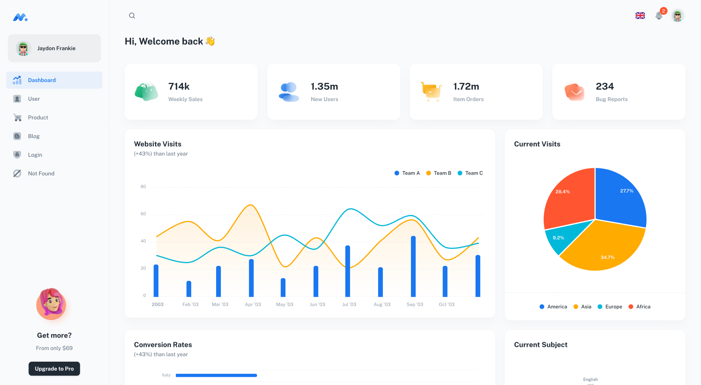

## Minimal [(Free version)](https://minimal-kit-react.vercel.app/)


> Free React Admin Dashboard made with Material-UI components and React.



## Demo

- [Dashboard Page](https://minimal-kit-react.vercel.app/)
- [Users Page](https://minimal-kit-react.vercel.app/user)
- [Products Page](https://minimal-kit-react.vercel.app/products)
- [Blog Page](https://minimal-kit-react.vercel.app/blog)
- [Login Page](https://minimal-kit-react.vercel.app/login)
- [Not Found Page](https://minimal-kit-react.vercel.app/404)

## API environment configuration

Set the API URL in one file, `client_admin/.env` (ignored by Git):

```dotenv
VITE_API_BASE_URL=https://airport-taxi-izm.chevalierlabsas.org/api/
```

For a local backend, change the value to `http://localhost:3001/api/`.
Include the `/api/` path. Both `npm run dev` and `npm run build` use this setting.
If the variable is unset or empty, the app defaults to the local backend.

Run commands from `client_admin`. Restart the dev server after editing `.env`;
for deployed apps, rebuild and redeploy. `npm run start` only previews the
existing build. Deployment environment variables supplied at build time take
precedence over `.env`.

Vite embeds `VITE_` variables in browser code. Do not put secrets in them.

## Quick start

- [Download from Github](https://github.com/minimal-ui-kit/material-kit-react/archive/refs/heads/main.zip) or clone the repo : `git clone https://github.com/minimal-ui-kit/material-kit-react.git`
- Recommended `Node.js v18.x`.
- **Install:** `yarn install`
- **Start:** `yarn dev`
- **Build:** `yarn build`

## Upgrade to PRO Version

| Minimal Free     | [Minimal Pro](https://material-ui.com/store/items/minimal-dashboard/) |
| :--------------- | :-------------------------------------------------------------------- |
| **6** Demo Pages | **70+** Demo Pages                                                    |
| -                | Authentication with **Amplify**, **Auth0**, **JWT** and **Firebase**  |
| -                | [+More components](https://minimals.cc/components)                    |
| -                | Dark & light mode                                                     |
| -                | Next.js version                                                       |
| -                | TypeScript version (Standard Plus and Extended license)               |
| -                | Design Figma File (Standard Plus and Extended license)                |
| -                | Complete Users Flows                                                  |
| -                | Learn more: [Package & License](https://docs.minimals.cc/package)     |

## License

Distributed under the MIT License. See [LICENSE](https://github.com/minimal-ui-kit/minimal.free/blob/main/LICENSE.md) for more information.

## Contact us

Email: support@minimals.cc
